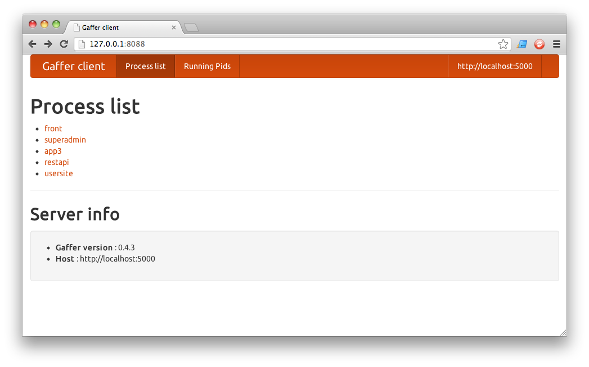
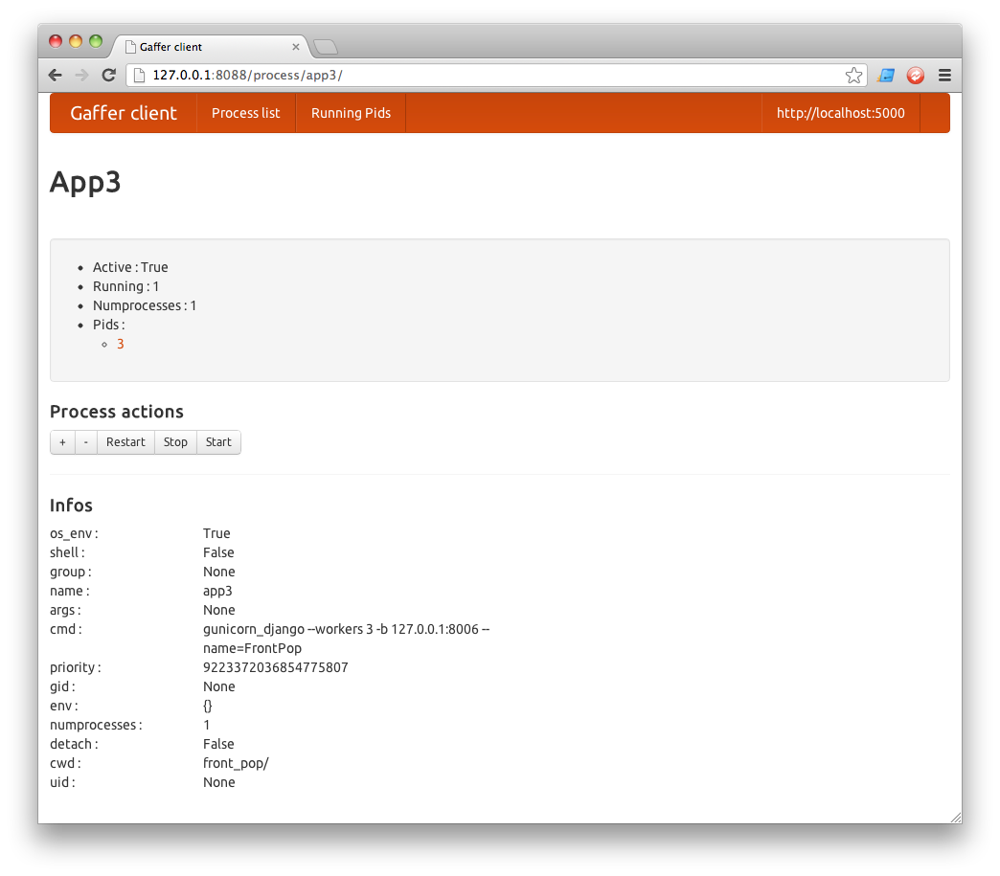

Gaffer Django Client
===

Is a django application that control processes throught gaffer. 

Features
===

 * List your processes
 * View informations on process (active, numprocesses, pids ...)
 * Manage your process (add, restart, stop, start)
 * View running pids

